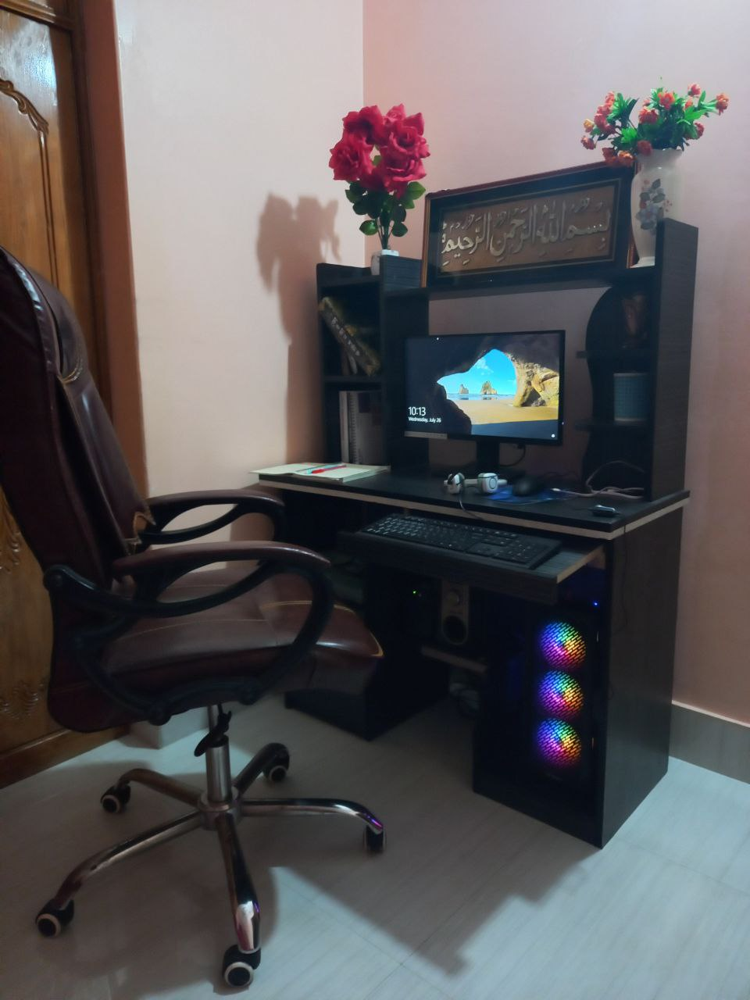

<!-- markdown practice -->
Md.Masum Hossain<br/>  
This is  second line
---
# Masum Hossain
## Masum Hossain
### Masum Hossain
#### Masum Hossain
##### Masum Hossain
###### Masum Hossain
line
<p>This is Md.Masum Hossain . I am programmer at Hannan Group.I have been working as programmer 9 years.</p>

this is an italic text_  
~~this is strike through~~   
`this is inline`  <h1>Bangladesh</h1>  
 ```
 <html>
    <head>
        <body>
        </body>
    </head>
 </html>
 ```  
 ```html
 <html>
    <head>
        <body>
        </body>
    </head>
 </html>
 ``` 
 ```css
 head{
    background-color:green;
 }
 
 ``` 


 ```javascript
 console.log('hello')
 ``` 
 1.item1
 2.item2
     1.item1.1
     2.item2.2
 3.item3

 ###unorder list  
 -item1  
 -item2  
 ### task list  
 - [x]task1  
 - [x]task2  
 - [x]task3  
 ### automatic link  
 http://www.studywithanis.com  

 ### disable link  
 `http://www.studywithanis.com`
  

  ### markdown link sytax

 [title](link) 
 ### image sytax  
 ---
 <!--  -->
  
--- <br/>
 |name|email |
 |----|------| 
| MD.Masum Hossain || masummiah.dev@gmail.com |


  


